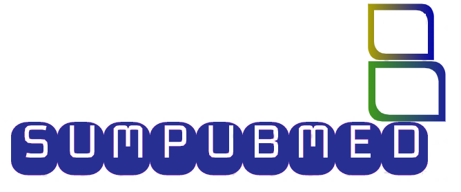
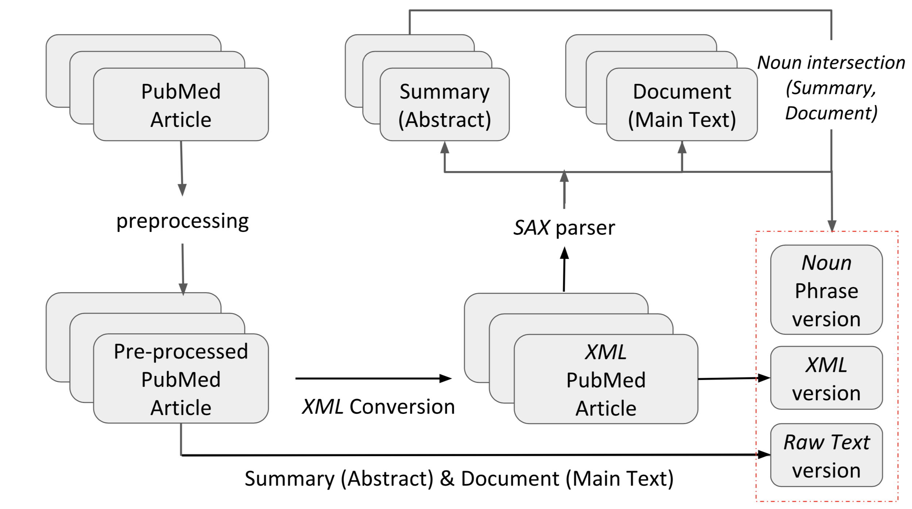

<p align="center"></p>

## [SUMPUBMED: Summarization Dataset of PubMed Scientific Article](https://vgupta123.github.io/docs/121-paper.pdf)

SUMPUBMED is a dataset for abstractive summarization over scientific article. The dataset use the [PubMed bio-medical article](https://catalog.data.gov/dataset/pubmed) to create the SUMPUBMED summarization dataset. PubMed comprises of more than 26 million citations for biomedical literature from MEDLINE, life science journals, and online books. Citations may include links to full-text content from PubMed Central and publisher web sites. 

For creating SUMPUBMED, we downloaded around 33,772 documents identified as BMC literature. BMC (BIO MED CENTRAL) literature incorporates BMC health services research papers related to medicine, pharmacy, nursing, dentistry, health care, and so on. 

### Pipeline

<p align="center"></p>

### DataSet Structure

After downloading, you have multiple sub-folders with several text files. Datasets contains the following four folders as described below :

``` 
shorter_abstract: final short summary of the text
abstract: long summary of the text (background, results, conclusions)
line_text: text with a single sentence in a line
text: contain the PubMed text in the raw form
human_annotation.tsv : human annotation of random 50 examples 
```

### Recomended Citation

Please cite the below paper if you intent to use the dataset for your research.

```
@inproceedings{bharti2020,
  booktitle = "Proceedings of the 2021 Conference of the Association for Computational Linguistics: Student Research Workshop",
  title={SUMPUBMED: Summarization Dataset of PubMed Scientific Article},
  author={Gupta, Vivek and Bharti, Prerna and Nokhiz, Pegah and Karnick, Harish},
  publisher = "Association for Computational Linguistics",
  year = "2021",
  url={https://vgupta123.github.io/docs/121-paper.pdf}
  year={2020}
}
```
### LICENCE

Carefully read the ***LICENCE*** and the ***Datasheet*** for non-academic usage. This dataset is licensed under the terms of the MIT license. Feel free to use the dataset for non-commercial academic purpose.

```
Note: Associated scripts for the baseline models would soon be available. 
The script for preprocessing is available in scripts folder as format_function.py
```
